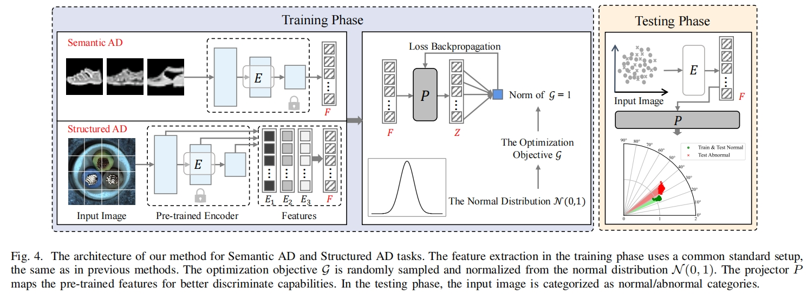
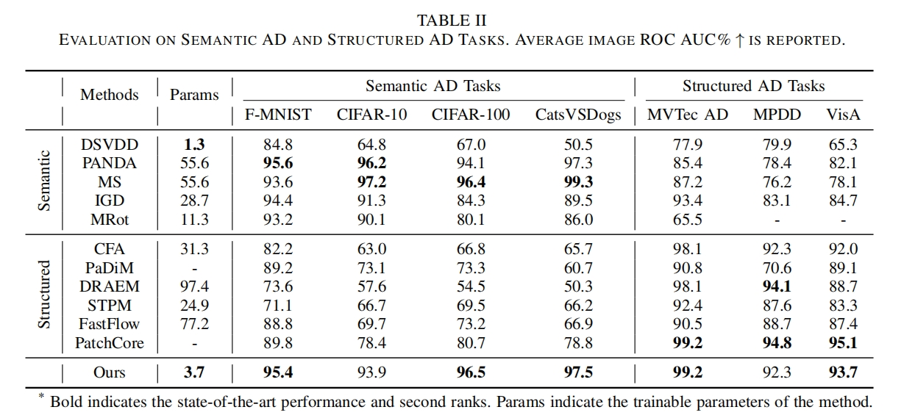
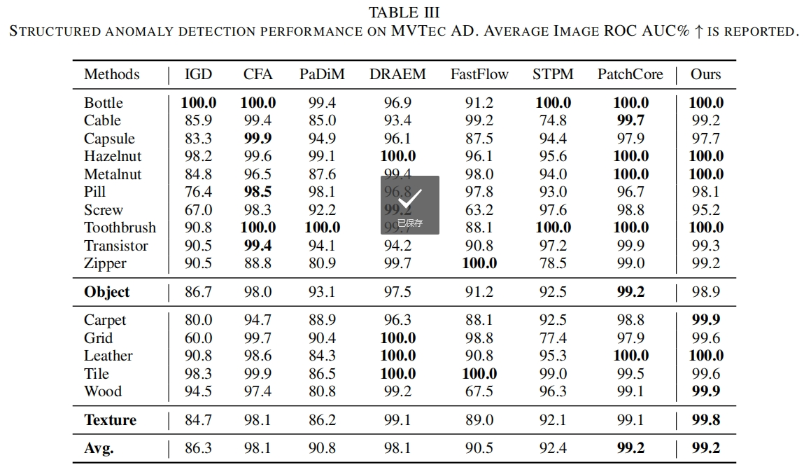

# A Norm-Constrained Method for Semantic and Structured Anomaly Detection Tasks
## Abstract
Benefiting from complex modeling processes, mainstream anomaly detection (AD) methods have achieved remarkable results on specific tasks. However, in the real world, especially within industrial inspection scenarios, tasks such as Semantic AD and Structured AD often coexist. Data from different AD tasks carry distinct attributes and follow different distributions. Such discrepancy makes it hard to design an anomaly detection method that can achieve excellent performance across various AD tasks. To address this issue, this paper proposes a simple and effective anomaly detection method, capable of achieving excellent performance in both Semantic AD and Structured AD tasks. Such good performance can be attributed to a key discovery in this study: \textit{Constraining the norm of the optimization objective within the optimal range helps enhance the performance of the anomaly detector.} Therefore, by constraining the norm within the shared optimal range across various AD tasks, the performance in both Semantic AD and Structured AD tasks can be improved. Extensive experiments validate the correctness of the proposed method. In addition, benefiting from the data-independent initiation and the fewer trainable parameters, the proposed method can be flexible to meet cold-start requirements in online AD scenarios.

## Method

## Performance

